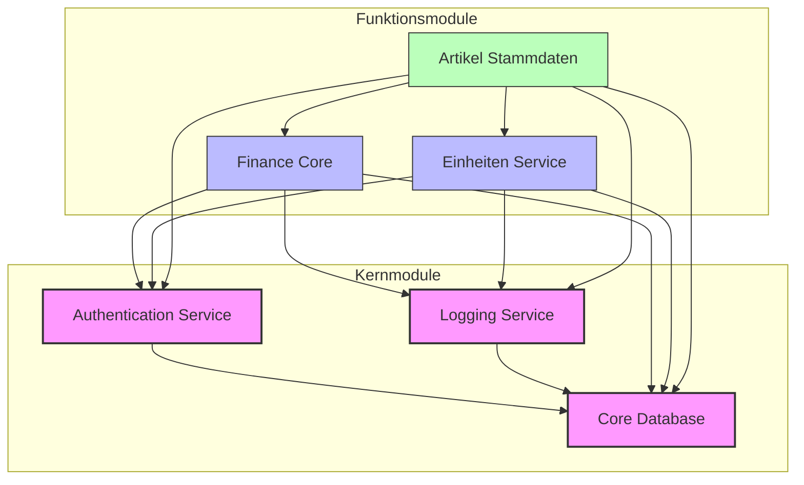
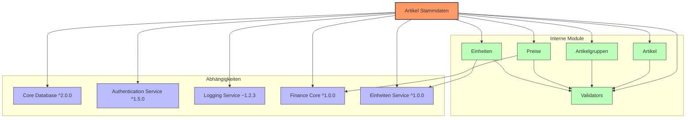

# Modulabhängigkeiten im ERP-System

Dieses Dokument zeigt die Abhängigkeiten zwischen den verschiedenen Modulen des ERP-Systems.

## Übersicht der Hauptmodule

## Detaillierte Abhängigkeiten des Artikelstammdaten-Moduls

## Versionskompatibilität

Die folgende Tabelle zeigt die Versionskompatibilität zwischen den Modulen:

| Modul | Version | Abhängigkeiten |
|-------|---------|----------------|
| core-database | 2.0.0 | - |
| auth-service | 1.5.0 | core-database ^2.0.0 |
| logging-service | 1.2.3 | core-database ^2.0.0 |
| finance-core | 1.0.0 | core-database ^2.0.0, auth-service ^1.5.0, logging-service ~1.2.3 |
| einheiten-service | 1.0.0 | core-database ^2.0.0, auth-service ^1.5.0, logging-service ~1.2.3 |
| artikel-stammdaten | 1.0.0 | core-database ^2.0.0, auth-service ^1.5.0, logging-service ~1.2.3, finance-core ^1.0.0, einheiten-service ^1.0.0 |

## Schnittstellenübersicht

Die folgende Tabelle zeigt die von den Modulen bereitgestellten Schnittstellen:

| Modul | Schnittstelle | Version | Beschreibung |
|-------|---------------|---------|--------------|
| finance-core | FinancialTransactionAPI | 1.0.0 | API für Finanztransaktionen |
| finance-core | AccountingAPI | 1.0.0 | API für Buchhaltungsfunktionen |
| artikel-stammdaten | ArtikelStammdatenAPI | 1.0.0 | API für die Verwaltung von Artikelstammdaten |
| artikel-stammdaten | ArtikelSucheAPI | 1.0.0 | API für die Suche nach Artikeln | 